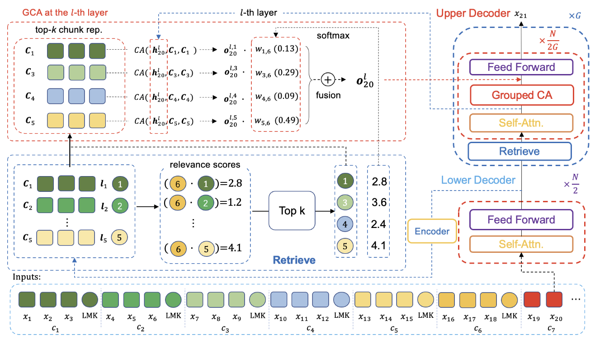
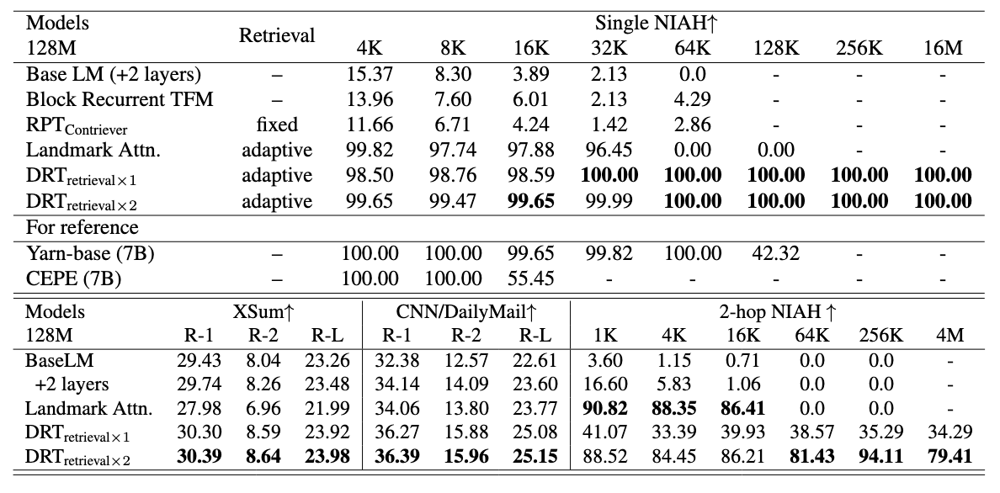

Official implementation for paper "[Efficient Length-Generalizable Attention via Causal Retrieval for Long-Context Language Modeling](https://arxiv.org/abs/2410.01651)" (ICML 2025)

### Model Architecture

When generating the current chunk (c7), GCA (Grouped CA) retrieves past chunks using the landmark representation of c6 to assist in token prediction for the next chunk. The key to GCA's length generalization lies in an end-to-end differentiable retrieval mechanism, which is achieved through a two-stage attention mechanism. After selecting the top-k chunks:

In the first stage, each token in c7 performs attention with the tokens within the retrieved chunk respectively to obtain information from that chunk. Taking the example in the diagram, $x^{20}$ interacts with the tokens of the i-th retrieved chunk through attention, resulting in the corresponding output $O_{20}^i$.

In the second stage, the softmax-normalized retrieval scores of the chunks are used as weights to perform a weighted summation of $O_{20}^i$, thereby incorporating the retrieval scores into the forward propagation process.

During backpropagation (BP), the weights of past chunks that better facilitate token prediction for the next chunk will be enhanced, enabling end-to-end causal retrieval learning.

<!--The critical aspect is that tokens in c7 perform cross-attention with each retrieved chunk to obtain chunk-level information. Finally, this information is fused using weights derived from a softmax over the retrieval scores, allowing the retrieval scores to participate in the forward process and making it differentiable.
-->
### Results


All models were pre-trained on contexts of no more than 16K tokens, and all attention spans are limited to no more than 728 tokens. Our model (DRT) achieves 1000x extrapolation on the needle-in-a-haystack task, maintaining high accuracy even with 16M context length.

### Environments
torch==2.4.0, transformers>=4.36.0, triton==3.0.0

`pip install requirements.txt`

### Data Preparation

[ArXiv-math](https://huggingface.co/datasets/hoskinson-center/proof-pile), [PG19](https://huggingface.co/datasets/emozilla/pg19), [XSUM](https://huggingface.co/datasets/EdinburghNLP/xsum), [CNN/DailyMail](https://huggingface.co/datasets/abisee/cnn_dailymail)

Before pre-training, ensure that the corpus is indexed. Pre-processing script:

PG19: `python preprocess/pg19_prepare.py`

ArXiv: `python preprocess/arxiv_math_prepare.py`

Summarization: `python preprocess/summarization_preprocess.py`


### Triton unittest

`pytest ltriton/gca.py`

### Pre-training

`sh scripts/pretrain_pg19.sh`

### Downstream tasks finetuning

Summarization tasks

`sh scripts/xsum_ft.sh`


NIAH tests

`sh scripts/niah_ft.sh`

Please note that we have observed whether to enable `softmax_off_by_one` has an impact on the results. Therefore, when fine-tuning for the NIAH task, we use vanilla softmax by setting `enable_softmax_one` to false in the config. 

### Evaluation

Eval perplexity:

```bash
python slidewin_eval.py \ 
   	 --config_path PATH_TO_YOUR_CONFIG \
    --vocab_dir config/gpt2-small \
    --corpus_path PATH_TO_VALID_SET \
    --max_seq_len MAX_SEQ_LEN \
    --stride -1 \
    --checkpoint_path PATH_TO_YOUR_CHECKPOINT \
    --model_type MODEL_TYPE(DRT/slide_window_lm/rpt_contriever/blk_rec_tfm/llama_with_landmark)
```
    
Eval passkey-retrieval:

```bash
python slidewin_eval.py \
    --config_path PATH_TO_YOUR_CONFIG \
    --vocab_dir config/gpt2-small \
    --corpus_path PATH_TO_VALID_SET \
    --max_seq_len MAX_SEQ_LEN \
    --passkey_retrieval single/multihop/multi \
    --stride -1 \
    --checkpoint_path PATH_TO_YOUR_CHECKPOINT \
    --model_type MODEL_TYPE(DRT/slide_window_lm/rpt_contriever/blk_rec_tfm/llama_with_landmark)
```
    
To evaluate the summarization task, you need to first generate the summary and then evaluate the generated results. The script for the generation part is as follows:

```bash
python eval/gen_summarization.py \
  --model_path PATH_TO_FINETUNED_MODEL \
  --model_type MODEL_TYPE \
  --config_path PATH_TO_YOUR_CONFIG \
  --vocab_dir config/gpt2-small \
  --corpus_path /PATH_TO_PREPROCESSED_CORPUS/test.pkl \
  --output_path /PATH_TO_OUTPUT/OUTPUT_NAME.pkl
```


### Contact
If you encounter any problems, please feel free to contact us: aaron.hx AT antgroup.com